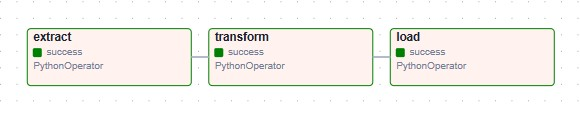
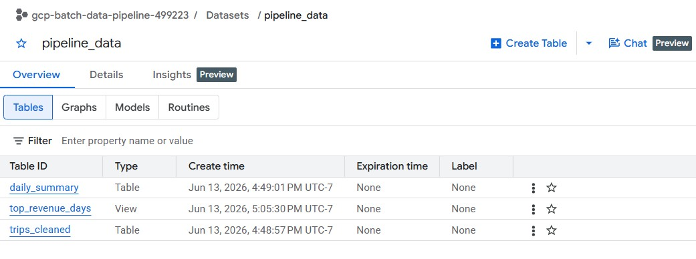
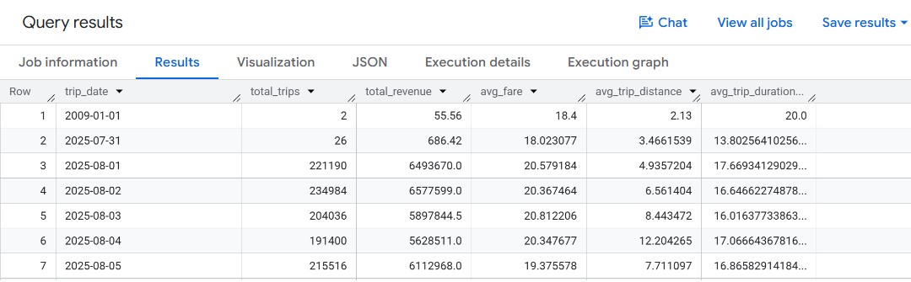

# GCP Batch Data Pipeline

An end-to-end ETL pipeline built on Google Cloud Platform that processes NYC Yellow Taxi trip data. Raw Parquet files are ingested from Cloud Storage, transformed and aggregated using Python, loaded into BigQuery, and orchestrated on a daily schedule with Apache Airflow running inside Docker.

---

## Pipeline Overview

The pipeline runs three steps in sequence each time it executes:

1. **Extract** — Downloads raw Parquet files from a Cloud Storage bucket
2. **Transform** — Cleans, filters, and aggregates the trip data into a daily summary using pandas
3. **Load** — Loads the transformed results into BigQuery

A SQL view is built on top of the loaded table to rank days by total revenue.

---

## Airflow DAG

All three steps run as tasks inside an Airflow DAG with strict dependencies. Transform will not start until Extract succeeds, and Load will not run unless Transform completes cleanly. The DAG runs on a daily schedule and can also be triggered manually.



---

## BigQuery Output

The pipeline produces a `daily_summary` table in BigQuery with total trips, total revenue, average fare, average distance, and average trip duration per day. A `top_revenue_days` view ranks days by revenue using a window function.





---

## Tech Stack

| Tool | Purpose |
|---|---|
| Google Cloud Storage | Raw data landing zone |
| Google BigQuery | Data warehouse for storing and querying results |
| Python / pandas / pyarrow | ETL logic: extraction, transformation, aggregation |
| Apache Airflow 2.9 | Pipeline orchestration and daily scheduling |
| Docker / Docker Compose | Local Airflow environment |
| SQL | Analytical view on top of the loaded BigQuery table |

---

## Project Structure

```
gcp-batch-data-pipeline/
├── dags/
│   └── pipeline_dag.py        # Airflow DAG definition
├── scripts/
│   ├── extract.py             # Downloads Parquet files from GCS
│   ├── transform.py           # Cleans, filters, and aggregates data
│   └── load.py                # Loads transformed data into BigQuery
├── screenshots/               # Pipeline output screenshots
├── docker-compose.yaml        # Airflow local setup
└── .gitignore
```

---

## Dataset

NYC Yellow Taxi Trip Records covering August through October 2025, sourced from the [NYC TLC Trip Record Data](https://www.nyc.gov/site/tlc/about/tlc-trip-record-data.page) portal. Approximately 11 million rows across three months.

---

## Key Design Decisions

**Per-file processing in transform.py**
The original version loaded all 11 million rows into a single DataFrame and hit an out-of-memory error at around 6.4GB of resident memory inside the container. The rewrite processes each monthly file individually, aggregates it immediately, and releases it from memory before loading the next one. This keeps peak memory usage to roughly a third of the original and reflects how real pipelines handle large rolling batch arrivals.

**WRITE_TRUNCATE for full batch refresh**
Each pipeline run replaces the BigQuery table contents entirely. This is appropriate for a batch pattern where the full dataset is reprocessed on each run. A production version would use partitioned BigQuery tables with incremental loads instead.

**Local Docker instead of Cloud Composer**
Cloud Composer (managed Airflow on GCP) costs around $300 per month at minimum. Running Airflow locally in Docker demonstrates the same orchestration concepts while still connecting to real GCP services for storage and warehousing.

---

## Setup

### Prerequisites
- Python 3.9+
- Docker Desktop
- A GCP project with Cloud Storage and BigQuery APIs enabled
- A service account with Storage Admin, BigQuery Data Editor, and BigQuery Job User roles

### 1. Clone the repo
```bash
git clone https://github.com/pp139515/GCP-Batch-Data-Pipeline.git
cd GCP-Batch-Data-Pipeline
```

### 2. Set up Python environment
```bash
python -m venv venv
source venv/Scripts/activate
pip install google-cloud-storage google-cloud-bigquery pandas pyarrow python-dotenv
```

### 3. Configure environment variables
Create a `.env` file in the project root:
```
GOOGLE_APPLICATION_CREDENTIALS=/path/to/service-account-key.json
GCP_PROJECT_ID=your-project-id
GCS_BUCKET_NAME=your-bucket-name
BQ_DATASET=pipeline_data
```

### 4. Upload raw data to GCS
Upload Parquet files organized by date prefix, for example `raw/2025-08-01/yellow_tripdata_2025-08.parquet`.

### 5. Start Airflow
```bash
echo "AIRFLOW_UID=50000" >> .env
docker compose up airflow-init
docker compose up -d
```

Open `http://localhost:8080`, log in with `airflow` as both the username and password, find the `gcp_batch_pipeline` DAG, toggle it on, and trigger a run.
